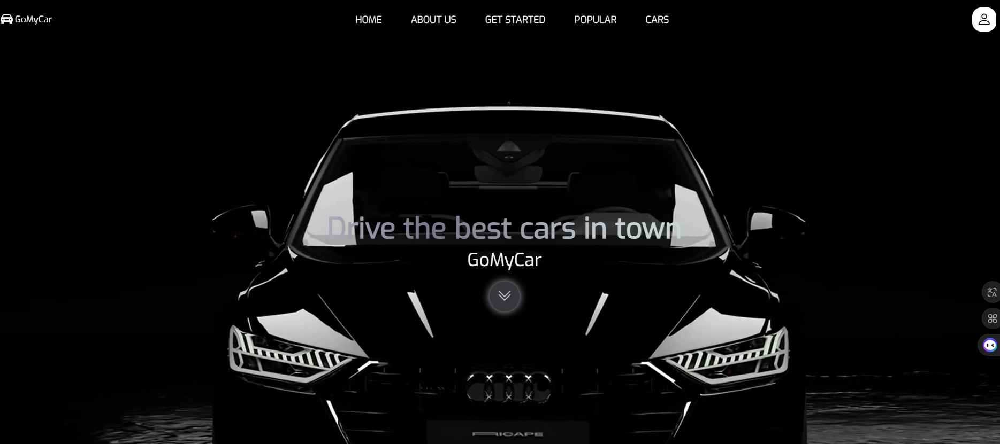

# 🚗 Car Rental Platform

A full-stack web application built with:
- **Front-end**: HTML5, CSS3, JavaScript
- **Back-end**: PHP (procedural)
- **Database**: MySQL

## 🎥 Demo Video

👉 [Télécharger la vidéo pour la regarder localement](Rent-Car video.mp4)

## 🖥️ Features
- Dynamic car catalog display
- Add and manage vehicles
- Availability status (available / not available)
- Responsive and user-friendly interface

